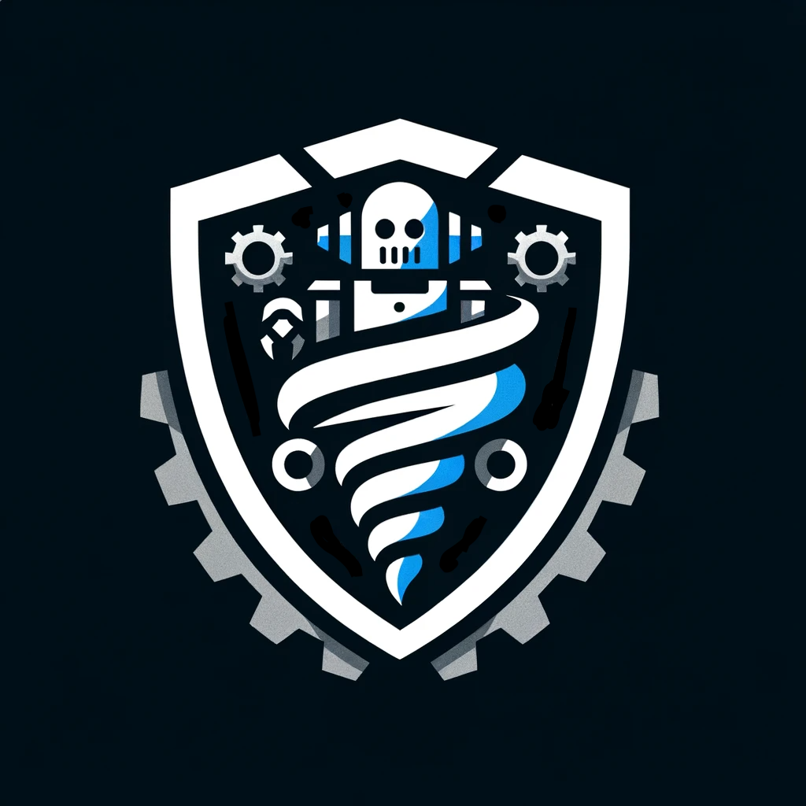

# HMS Robotics Website

Official website for Hornedo Middle School's Robotics Program, showcasing our VEX Robotics teams, programs, and achievements.



## 🤖 Overview

This website serves as the central hub for HMS Robotics, providing information about our programs, competitive teams, upcoming events, and how students can join our robotics community. Built with modern web technologies and a sleek, dark theme that reflects our tech-focused mission.

## Features

- **Responsive Design** - Fully responsive layout that works on all devices
- **Dark Theme** - Professional dark color scheme with blue accents
- **Smooth Animations** - Subtle animations including floating logos and rotating gears
- **Program Information** - Details about W.I.N. classes, after-school club, and competition teams
- **Event Calendar** - Upcoming competitions and important dates
- **Easy Navigation** - Sticky navbar with smooth scrolling to sections

## Technologies Used

- **HTML5** - Semantic markup
- **CSS3** - Custom styling with animations
- **Bootstrap 5.3.2** - Responsive grid and components
- **Bootstrap Icons** - Icon library
- **Google Fonts** - Bebas Neue & Inter fonts
- **JavaScript** - Navigation and interactivity

## Project Structure

```
hms-robotics/
├── index.html              # Main HTML file
├── css/
│   └── styles.css         # Custom CSS styles
├── js/
│   └── main.js           # JavaScript functionality
├── images/
│   ├── HMSR_Logo-onblack.png      # Navigation logo
│   └── HMSR_Logo-BlackWhiteSil.png # Hero section logo
└── README.md              # This file
```

## Color Palette

- **Primary Blue**: `#2196F3`
- **Primary Dark**: `#1976D2`
- **Secondary Red**: `#FF0000`
- **Black**: `#000000`
- **Dark Sections**: `#0a0a0a`, `#111111`

## Sections

1. **Hero** - Eye-catching landing with animated logo
2. **Programs** - Information about our three main programs
3. **Teams** - Showcase of competitive VEX teams 4063A and 4063B
4. **Join** - Steps to join the robotics program
5. **Calendar** - Upcoming events and competitions
6. **Contact** - Instructor information and location


## Contact

**Instructor**: Mark Johnston  
**Email**: majohnst@episd.org

## Contributing

This website is maintained by the HMS Robotics program. For suggestions or issues, please contact Mr. Johnston.

## License

© 2025 HMS Robotics - Hornedo Middle School. All rights reserved.

---

**Building Tomorrow's Innovators Today**
